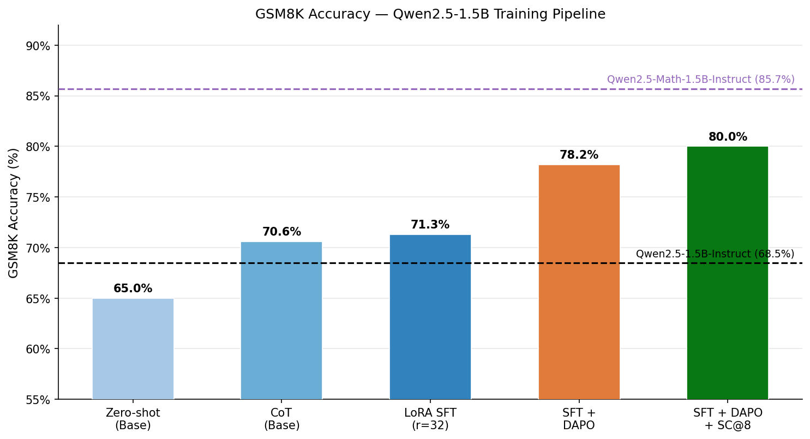
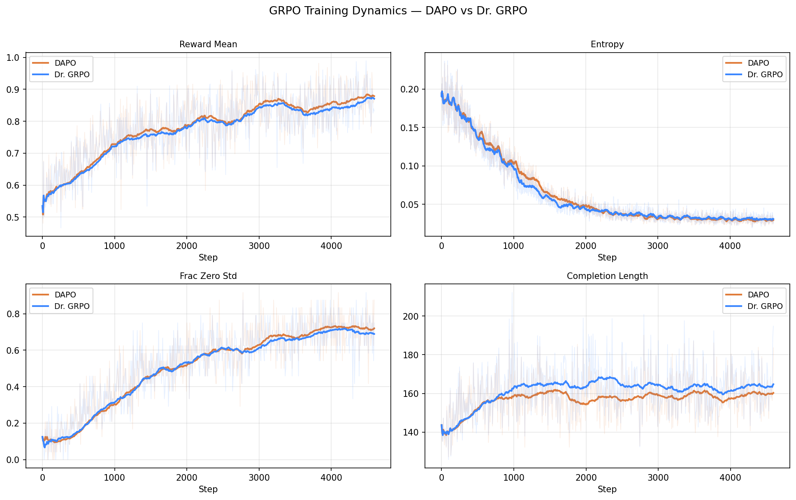
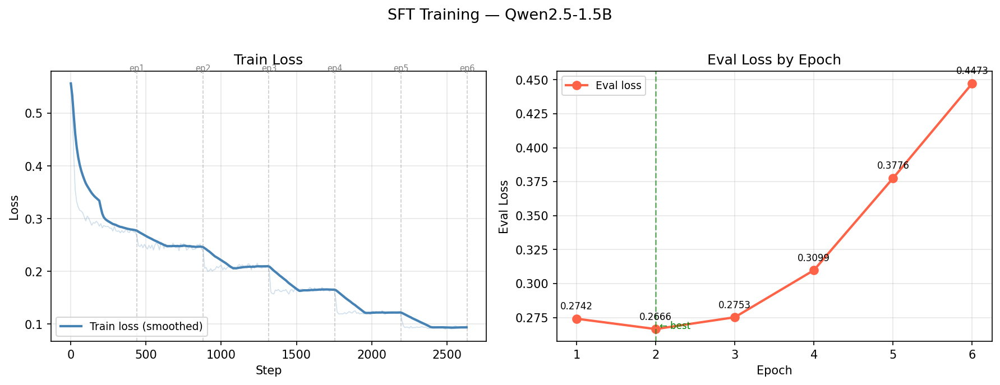

# Post-Training Adaptation: From Base Model to 80% on GSM8K

<p align="center">
  <b>Achieving 80% on GSM8K with Qwen2.5-1.5B using LoRA SFT + GRPO (DAPO / Dr. GRPO) on a single A100 40GB.</b>
</p>

<p align="center">
  <a href="#results">Results</a> •
  <a href="#method">Method</a> •
  <a href="#training">Training</a> •
  <a href="#key-findings">Key Findings</a>
</p>

---

## Highlights

- **80.0% accuracy on GSM8K** (78.2% greedy + SC@8) starting from a pure pre-trained base model (Qwen2.5-1.5B)
- **Comparison with official models**: Qwen2.5-1.5B-Instruct (68.5%), Qwen2.5-Math-1.5B-Instruct (85.7%)
- **Progressive improvement**: Zero-shot (65.3%) → CoT (70.6%) → SFT (71.3%) → DAPO (78.2%) → SC@8 (80.0%)
- **Self-consistency SC@8** adds +1.5pp without additional training: 78.2% → 80.0%
- **Data pre-filtering** for RL training: 7,473 → 2,779 questions (37.2% retained)
- **GRPO loss comparison**: DAPO vs Dr. GRPO — both methods achieve nearly identical accuracy; DAPO produces slightly shorter completions

## Results


| Method | GSM8K Accuracy | Avg Tokens | Truncated |
|--------|:-:|:-:|:-:|
| Zero-shot (Base) | 65.3% | 268 | 5.5% |
| CoT Prompting | 70.6% | 274 | 4.9% |
| LoRA SFT (r=32, 67K data) | 71.3% | 127 | 0.5% |
| **LoRA SFT + DAPO** | **78.2%** | **138** | **0.4%** |
| **LoRA SFT + Dr. GRPO** | **77.9%** | **139** | **0.4%** |
| **SFT + DAPO + SC@8** | **80.0%** | **138** | **0.4%** |
| Qwen2.5-1.5B-Instruct (official) | 68.5% | 308 | 4.1% |
| Qwen2.5-Math-1.5B-Instruct (official) | 85.7% | 301 | 4.1% |

<p align="center">
  
</p>

### GRPO Training Progress

| Checkpoint | DAPO | Dr. GRPO |
|:----------:|:----:|:--------:|
| Step 1840 (ep 2) | 76.6% | 77.9% |
| Step 2760 (ep 3) | **78.2%** | 75.9% |
| Step 3680 (ep 4) | 77.1% | 77.1% |
| Step 4600 (ep 5) | 77.0% | 76.6% |

<p align="center">
  
</p>

## Method

### Overview

```
Qwen2.5-1.5B-Base (65.3% CoT)
    │
    ├── Stage 1: LoRA SFT on 67K high-quality CoT data
    │   └── 71.3% (+0.7pp over base CoT)
    │
    └── Stage 2: GRPO (DAPO / Dr. GRPO) on 2,779 pre-filtered questions
        └── 80% (+8.9pp)
```

### Stage 1: Supervised Fine-Tuning (SFT)

- **Data**: 67K examples from [OpenMathInstruct-2](https://huggingface.co/datasets/nvidia/OpenMathInstruct-2) (`augmented_gsm8k` subset), generated by Llama-3.1-405B-Instruct. For each problem, the shortest correct solution is selected.
- **Format**: Plain text prompt-completion with native `<|endoftext|>` as EOS
- **Training**: LoRA r=32, α=128, 1 epoch, `completion_only_loss=True`, Flash Attention 2, sequence packing
- **Time**: 188 minutes on A100

### Stage 2: GRPO Reinforcement Learning

Two loss variants are compared:

- **DAPO** ([paper](https://arxiv.org/abs/2503.14476), TRL 1.3.0): asymmetric clipping (`epsilon=0.2`, `epsilon_high=0.28`), truncated completion masking, `beta=0.0`
- **Dr. GRPO** (TRL 1.3.0): decoupled reward normalization — removes bias in advantage estimation, produces shorter completions

**Shared config**:
- No KL penalty (`beta=0.0`)
- Graded reward: correct `\boxed{}` (+1.0), wrong answer (0.0), no `\boxed{}` (−0.5)
- 16 rollouts/question, `lr=5e-6`, cosine schedule
- Data: 2,779 questions pre-filtered from GSM8K train (see below)

### Data Pre-filtering for RL

Offline implementation of Dynamic Sampling to improve RL training efficiency:

1. Run SFT model on all 7,473 GSM8K training questions (8 rollouts each)
2. Compute per-question success rate
3. Keep questions with `success_rate < 1.0` (easy questions removed — no learning signal)

| Success Rate | Questions | % | Action |
|:---:|:---:|:---:|:---:|
| 100%  | 4,694 | 62.8% | **Removed** |
| 12%–87% | 2,536 | 33.9% | Kept |
| 0%  | 243 | 3.3% | Kept |

**Result**: 2,779 questions retained (37.2% of train set).

## Key Findings

### GRPO Drives the Main Accuracy Gain

Despite SFT using 67K high-quality examples, it contributes only +0.5pp over a well-prompted base model. The reasoning capability was already present — SFT primarily teaches format alignment (stopping at `<|endoftext|>`, using `\boxed{}`). GRPO then unlocks the actual accuracy improvement (+7pp).

### Dr. GRPO vs DAPO

On GSM8K, both methods yield nearly identical final accuracy (DAPO 78.2%, Dr. GRPO 77.9%) — the choice of loss variant does not significantly matter for this task. The main observable difference is in response length: **DAPO produces slightly shorter completions** (138 vs 139 tokens on average), despite Dr. GRPO's theoretical motivation of reducing length bias. Both methods maintain very low truncation rates (~0.4%), indicating the model reliably outputs `\boxed{}` answers within the token budget.

### BPE Tokenization Mismatch with completion_only_loss

When using TRL's `completion_only_loss=True` with separate `prompt`/`completion` fields, BPE tokenizers can produce a tokenization boundary mismatch: `"Solution: "` followed by a word tokenizes differently when tokenized in isolation vs. as prefix of the full text (the space gets merged with the next token).

**Fix**: End the prompt with `\n` instead of a space — newline characters always tokenize as their own token, creating a clean boundary.

### SFT Overfitting on High-Quality Data
<p align="center">
  
</p>
With 67K high-quality 405B-generated CoT examples, the model converges in 1 epoch. Additional epochs cause overfitting (eval loss increases). Best checkpoint: epoch 2.

### Self-Consistency as a Free Accuracy Boost

SC@8 (majority vote over 8 samples) adds +1.4pp without any additional training. Agreement metric: 75% of questions answered unanimously correctly across all 8 samples.

## Training

### Stage 1: Data Preparation

```bash
python scripts/prepare_sft_data.py
```

### Stage 2: SFT Training

```bash
python scripts/sft_train.py \
    --lora_r 32 \
    --num_epochs 1 \
    --batch_size 8 \
    --grad_accum 4 \
    --lr 2e-4 \
    --no_wandb
```

### Stage 3: RL Data Filtering

```bash
python scripts/filter_grpo.py \
    --adapter_path results/sft_gsm8k/r32/checkpoint-878
```

### Stage 4: GRPO Training

```bash
# Dr. GRPO
python scripts/grpo_train.py \
    --adapter_path results/sft_gsm8k/r32/checkpoint-878 \
    --loss_type dr_grpo \
    --no_wandb

# DAPO
python scripts/grpo_train.py \
    --adapter_path results/sft_gsm8k/r32/checkpoint-878 \
    --loss_type dapo \
    --no_wandb
```

### Evaluation

```bash
# Baseline (base model)
python scripts/eval_base_gsm8k.py

# SFT checkpoints
python scripts/eval_sft.py --checkpoints_dir results/sft_gsm8k/r32

# GRPO checkpoints (both methods)
python scripts/eval_grpo.py

# Reference models (instruct)
python scripts/eval_instruct.py
python scripts/eval_instruct.py --model Qwen/Qwen2.5-Math-1.5B-Instruct

# Self-consistency
python scripts/eval_sc.py \
    --sft_adapter results/sft_gsm8k/r32/checkpoint-878 \
    --adapter_path results/grpo/dr_grpo_g16/checkpoint-4600 \
    --num_samples 8
```

## Project Structure

```
scripts/
├── prepare_sft_data.py     # Data preparation (OpenMathInstruct-2 → Plan B format)
├── sft_train.py            # LoRA SFT training
├── filter_grpo.py          # Filter GSM8K train set by rollout success rate
├── grpo_train.py           # GRPO training (DAPO / Dr. GRPO)
├── eval_base_gsm8k.py      # Evaluate base model (zero-shot + CoT)
├── eval_sft.py             # Evaluate SFT / GRPO checkpoints (with LoRA)
├── eval_grpo.py            # Evaluate all GRPO checkpoints across methods
├── eval_instruct.py        # Evaluate instruct reference models
└── eval_sc.py              # Self-consistency evaluation (SC@N)
src/
├── utils.py                # Answer extraction, seeding, GSM8K loading
notebooks/
├── analyze_sft_results.ipynb   # SFT checkpoint analysis
├── analyze_grpo.ipynb          # DAPO vs Dr. GRPO training dynamics
└── error_analysis.ipynb        # Cross-model error analysis
data/
├── processed_gsm8k_sft_planb/  # SFT training data (Plan B format)
└── grpo_filtered/              # Filtered RL training data
results/
├── gsm8k_baseline/             # Base model evaluation results
├── gsm8k_sft/                  # SFT model evaluation results
├── gsm8k_grpo/                 # GRPO model evaluation results
├── gsm8k_instruct/             # Reference model evaluation results
├── gsm8k_sc/                   # Self-consistency results
├── sft_gsm8k/                  # SFT training checkpoints and logs
└── grpo/                       # GRPO training checkpoints and logs
```

## Training Cost

| Stage | Time | Hardware |
|-------|:----:|:--------:|
| SFT (1 epoch, 67K data) | 188 min | A100 40GB |
| Data Filtering (7.5K × 8 rollouts) | 40 min | A100 40GB |
| GRPO DAPO (5 epochs, 2.8K data) | 12.5 h | A100 40GB |
| GRPO Dr. GRPO (5 epochs, 2.8K data) | 12.5 h | A100 40GB |
| **Total** | **~29.6 h** | **Single A100 40GB** |

## Acknowledgments

- [Qwen2.5](https://github.com/QwenLM/Qwen2.5) for the base model
- [OpenMathInstruct-2](https://huggingface.co/datasets/nvidia/OpenMathInstruct-2) for high-quality CoT training data
- [TRL](https://github.com/huggingface/trl) for DAPO/GRPO training framework
- [DAPO](https://arxiv.org/abs/2503.14476) for the RL algorithm
- [Dr. GRPO](https://arxiv.org/abs/2503.20783) for the decoupled reward normalization variant
- [Claude](https://claude.ai/) (Anthropic) for experiment design and code implementation
